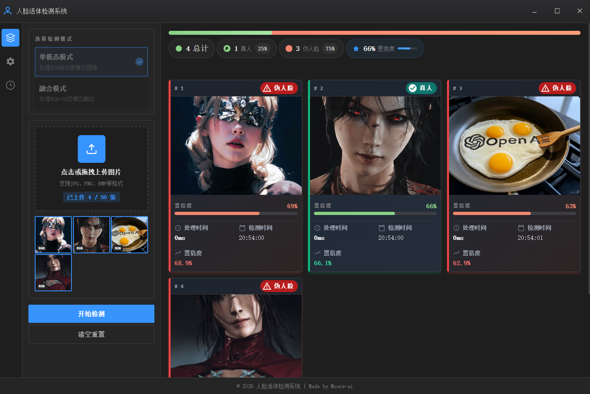
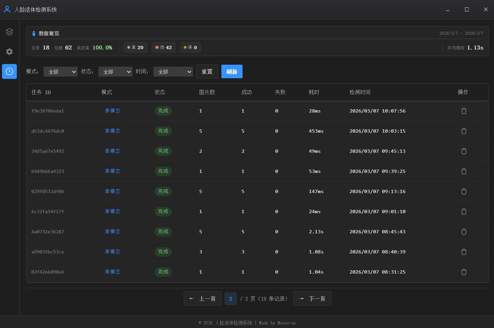
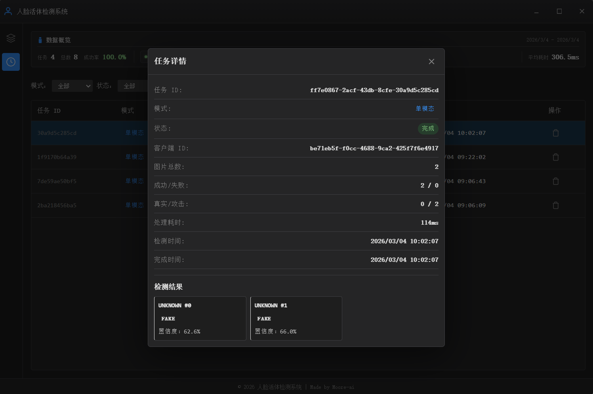

# 人脸活体检测系统前端

[](https://tauri.app/)
[](https://react.dev/)
[](https://www.typescriptlang.org/)
[](https://tailwindcss.com/)
[](https://www.rust-lang.org/)

基于 Tauri + React + TypeScript 开发的人脸活体检测桌面应用前端。支持单模态（RGB/IR）和融合模式（RGB+IR）检测，具有 VS Code 风格的深色主题界面。

> **后端仓库**: [github.com/Moore-ai/face-spoofing-detector-backend](https://github.com/Moore-ai/face-spoofing-detector-backend)

## 📸 预览

### 检测页面


### 历史记录页面


### 推理历史


## ✨ 功能特性

- 🔬 **双模式检测**：支持单模态（RGB/IR）和融合模式（RGB+IR）
- 📁 **批量处理**：可一次性上传多张图片进行检测（最多 50 张）
- 🖼️ **实时预览**：上传图片即时预览，支持拖拽上传
- 📊 **结果可视化**：置信度条形图、统计面板、详细结果卡片
- 🔄 **实时结果显示**：检测结果随处理进度实时显示，无需等待任务完成
- ⚠️ **错误处理**：推理失败时显示错误卡片，带警告图标和详细错误信息
- 🎨 **VS Code 风格**：深色主题界面，左侧活动栏导航，现代化布局
- 🖥️ **自定义窗口**：完整的自定义标题栏，包含最小化、最大化和关闭按钮
- 🔄 **三栏布局**：活动栏、侧边栏和主内容区紧密排列，支持独立滚动
- ⚙️ **灵活配置**：通过环境变量和 YAML 配置文件自定义参数
- 🔒 **文件验证**：自动检测文件格式和有效性
- 🔑 **激活码认证**：支持激活码换取 API Key 进行认证
- 📜 **历史记录**：支持查询服务器端历史记录，可按模式、状态、时间范围过滤，支持分页浏览和任务详情查看
   - 检测完成后自动保存到本地 store，无需刷新即可显示
- 🛑 **任务取消**：检测过程中可随时取消正在执行的任务，取消后保留已处理的结果
- ⚙️ **设置页面**：支持快捷键绑定、历史记录保留期限设置、本地数据管理等功能
- ⌨️ **全局快捷键**：支持自定义快捷键触发检测、取消任务、清空重置操作，配置持久化保存

## 🛠️ 技术栈

- **前端框架**：React 19
- **开发语言**：TypeScript 5.9
- **构建工具**：Vite 7
- **桌面框架**：Tauri v2
- **样式方案**：Tailwind CSS 4 + 自定义 CSS 变量
- **状态管理**：Zustand + 自定义 Hook
- **后端**：Rust
- **配置管理**：YAML + dotenv

## 📦 项目结构

```
.
├── .env                          # 环境变量（本地配置，不提交）
├── .env.example                  # 环境变量示例
├── scripts/                      # 环境配置脚本
│   ├── setup-env.js              # 跨平台 Node.js 配置脚本
│   ├── setup-env.sh              # Shell 脚本（macOS/Linux）
│   ├── setup-env-windows.bat     # 批处理脚本（Windows）
│   ├── kill_port.sh              # 跨平台端口清理脚本（Unix Shell）
│   └── kill_port.bat             # 端口清理脚本（Windows）
├── src/                          # 前端源代码
│   ├── api/                      # Tauri API 封装
│   │   ├── tauri.ts           # Tauri 命令调用封装（含 WebSocket 事件监听）
│   │   └── commands.d.ts      # 命令类型定义
│   ├── components/               # React 组件
│   │   ├── layout/               # 布局组件
│   │   ├── ui/                   # 通用 UI 组件
│   │   ├── detection/            # 检测相关组件
│   │   ├── history/              # 历史记录组件
│   │   └── settings/             # 设置页面组件
│   │       ├── SettingsPage.tsx      # 设置页面主组件
│   │       ├── ShortcutsSettings.tsx # 快捷键设置组件
│   │       └── index.ts              # 组件统一导出
│   ├── hooks/                    # 自定义 Hooks
│   │   ├── useDetection.ts       # 封装 Zustand store 的状态管理 Hook
│   │   └── useGlobalShortcuts.ts # 全局快捷键监听 Hook
│   ├── types/                    # 类型定义
│   │   └── index.ts
│   ├── utils/                    # 工具函数
│   │   ├── imageUtils.ts
│   │   └── stats.ts
│   ├── store/                    # Zustand Store
│   │   ├── index.ts              # Store 统一导出
│   │   ├── detectionStore.ts     # 检测状态 Store（核心）
│   │   ├── websocketManager.ts   # WebSocket 事件管理器
│   │   ├── shortcutStore.ts      # 快捷键配置 Store
│   │   └── historyStore.ts       # 历史记录 Store
│   ├── App.tsx
│   └── main.tsx
├── docs/                         # 项目文档
│   └── client-server-communication.md  # 客户端 - 服务器通信详解
├── src-tauri/                    # Rust 后端代码
│   ├── src/
│   │   ├── main.rs          # 应用入口
│   │   ├── lib.rs           # Tauri 命令注册
│   │   ├── util.rs          # 检测命令实现 + WebSocket 连接管理
│   │   ├── config.rs        # 配置管理
│   │   └── shortcuts.rs     # 快捷键配置管理
│   ├── capabilities/
│   │   └── default.json     # 权限配置（包含窗口控制权限）
│   ├── config/
│   │   ├── config.yaml      # 应用配置
│   │   └── shortcuts.json   # 快捷键配置（运行时生成）
│   └── tauri.conf.json      # Tauri 应用配置（包含装饰设置）
└── package.json
```

## 🚀 快速开始

### 环境要求

- [Node.js](https://nodejs.org/) 18+
- [Rust](https://www.rust-lang.org/tools/install) 1.70+
- [Python](https://www.python.org/) 3.8+（用于运行后端检测服务）

### 1. 克隆项目

```bash
git clone <repository-url>
cd face-spoofing-detector-frontend
```

### 2. 使用环境配置脚本（推荐）

项目提供了跨平台的环境配置脚本，自动检查依赖并创建配置文件：

```bash
npm run setup:env
```

脚本会自动完成：
- 检查 Node.js、Rust、Python 是否安装
- 创建 `.env` 文件并设置正确的 `PROJECT_PATH`
- 安装前端依赖（如未安装）
- （Linux）检查 Tauri 编译依赖

### 3. 手动配置（可选）

如果不使用脚本，可手动配置：

```bash
npm install
cp .env.example .env
```

编辑 `.env` 文件：

```env
# 修改 PROJECT_PATH 为项目绝对路径
# Windows: PROJECT_PATH=E:\\heli_code\\frontend
# macOS/Linux: PROJECT_PATH=/home/user/frontend
PROJECT_PATH=<项目路径>

# 后端 API 地址（根据实际修改）
API_BASE_URL=http://localhost:8000
```

### 4. 启动开发服务器

```bash
# 启动完整应用（推荐）
npm run tauri dev

# 仅启动前端
npm run dev
```

## ⚙️ 配置说明

### 环境变量

| 变量名 | 说明 | 默认值 |
|--------|------|--------|
| `PROJECT_PATH` | 项目绝对路径 | 必填 |
| `API_BASE_URL` | 后端 API 基础地址 | `http://localhost:8000` |
| `HTTP_REQUEST_TIMEOUT` | HTTP 请求超时（秒） | `30` |
| `HTTP_CONNECT_TIMEOUT` | HTTP 连接超时（秒） | `10` |

### 应用配置

配置文件：`src-tauri/config/config.yaml`

```yaml
image:
  supported_formats:
    - jpg
    - jpeg
    - png
    - bmp
    - webp
  max_file_size_mb: 10
```

## 🖼️ 使用说明

### 单模态模式

1. 选择"单模态模式"
2. 上传 RGB 或 IR 图片
3. 点击"开始检测"
4. 查看结果统计和详情

### 融合模式

1. 选择"融合模式"
2. **按命名规范准备图片对**：
   - RGB 图片：`rgb_001.jpg`
   - IR 图片：`ir_001.png`
   - 标识符必须匹配（如 `001`）
3. 批量上传图片（系统会自动配对）
4. 点击"开始检测"
5. 查看融合检测结果

**命名规范示例：**
```
✅ rgb_001.jpg + ir_001.png    → 配对成功
✅ rgb_002.jpeg + ir_002.jpg   → 配对成功（扩展名可不同）
❌ rgb_001.jpg + ir_002.png    → 配对失败（标识符不匹配）
❌ photo_001.jpg               → 格式错误（缺少前缀）
```

## 🔧 开发指南

### 常用命令

```bash
# 环境配置
npm run setup:env

# 开发模式
npm run tauri dev

# 构建生产版本
npm run tauri build

# TypeScript 类型检查
npx tsc --noEmit

# Rust 代码检查
cd src-tauri && cargo check

# Rust 代码格式化
cd src-tauri && cargo fmt

# 端口清理（当端口被占用时）
./kill_port.sh 1420      # macOS/Linux
./kill_port.bat 1420     # Windows
```

### 代码规范

- **前端**：遵循 TypeScript/React 规范，使用函数式组件
- **后端**：Rust 代码使用 `snake_case`，返回 `Result<T, String>` 处理错误
- **样式**：使用 CSS 变量保持设计一致性

## 🔌 后端 API

后端使用 Python 提供检测服务，Rust 前端通过 HTTP 调用：

| 端点 | 方法 | 描述 |
|------|------|------|
| `POST /auth/activate` | 激活码验证 | 换取 API Key |
| `POST /infer/single` | 单模态检测 | 接收 base64 图片列表 |
| `POST /infer/fusion` | 融合模式检测 | 接收 RGB/IR 图片对 |
| `DELETE /infer/task/{task_id}` | 取消任务 | 取消正在执行的任务 |
| `GET /infer/task/{task_id}` | 任务状态查询 | 查询任务状态和结果 |
| `WS /infer/ws` | WebSocket 连接 | 接收任务进度和完成通知 |
| `GET /history` | 历史记录查询 | 查询历史任务记录（支持分页和过滤：client_id/mode/status/days） |
| `GET /history/stats` | 历史统计 | 获取检测任务的统计信息（支持 mode/status/days 过滤） |
| `DELETE /history` | 删除历史记录 | 删除指定的历史任务记录（API Key 认证即可） |

**详细通信协议**: 参见 [`docs/client-server-communication.md`](docs/client-server-communication.md)

**环境变量配置：**
```env
API_BASE_URL=http://localhost:8000
```

**WebSocket 消息类型：**
| 消息类型 | 说明 |
|---------|------|
| `progress_update` | 处理进度更新，包含当前结果 |
| `task_completed` | 任务全部完成（所有图片成功） |
| `task_partial_failure` | 任务部分失败（部分图片失败） |
| `task_failed` | 任务完全失败 |
| `task_cancelled` | 任务被用户取消 |

**错误响应格式：**
```json
{
  "mode": "single",
  "result": "error",
  "confidence": 0.0,
  "probabilities": [0.0, 0.0],
  "processing_time": 0,
  "error": "具体的错误信息",
  "image_index": 0
}
```

## 📝 注意事项

### 激活码使用

- 激活码格式：`ACT-XXXXXXXX-XXXXXXXX`（19 字符）
- 激活码为单次使用，使用后需要重新生成
- 激活成功后 API Key 存储在**系统密钥环**中（Windows Credential Manager / macOS Keychain / Linux Secret Service）

### API Key 安全存储

系统使用 [keyring](https://docs.rs/keyring) crate 将 API Key 安全存储在操作系统提供的加密存储中：

| 操作系统 | 存储位置 |
|----------|----------|
| Windows | Windows Credential Manager |
| macOS | macOS Keychain |
| Linux | GNOME Keyring / KWallet |

**优势**：
- 用户无法通过 DevTools 直接查看
- 防止 XSS 攻击窃取 API Key
- 使用操作系统级加密保护

**技术实现**：
- Rust 后端：`store_api_key`、`retrieve_api_key`、`delete_api_key` 命令
- 前端 API：`storeApiKey()`、`retrieveApiKey()`、`deleteApiKey()`
- 开发模式（浏览器）下降级使用 localStorage

### 竞态条件处理

由于后端处理速度可能很快，前端已实现竞态条件处理：
- 任务完成事件可能在 `detect_xxx_async` 返回之前到达
- 使用 `isTaskCompletedRef` 标记任务完成状态
- 避免 `taskId` 被错误覆盖

### 错误处理

系统支持完善的错误处理和显示：
- **错误检测**：当推理失败时，后端返回 `result: "error"` 和 `error` 字段
- **UI 显示**：错误结果以黄色警告样式显示，包含错误图标和消息
- **统计信息**：统计面板单独显示错误数量和百分比
- **部分失败**：当部分图片失败时，后端发送 `task_partial_failure` 消息，正常结果仍会显示

### 实时结果显示

前端采用实时结果显示策略：
- 检测结果在收到 `ws_progress` 事件时立即添加并显示
- 无需等待任务完成，用户可以在检测进行中查看已完成的结果
- 结果面板顶部显示进度条，指示当前处理进度

### 历史记录

检测任务完成后会自动保存到服务器数据库和本地 store，用户可通过活动栏的历史记录图标查看：
- **访问方式**：点击左侧活动栏的时钟图标
- **过滤功能**：支持按模式（单模态/融合）、状态（完成/部分失败/失败）、时间范围筛选
- **分页浏览**：每页显示 20 条记录，支持翻页
- **详情查看**：点击任意任务行可查看详细信息和检测结果
- **删除功能**：支持删除单条历史记录（API Key 认证即可）
- **数据存储**：所有历史记录存储在服务器端，便于跨设备访问
- **统计信息**：顶部显示统计卡片，根据当前筛选条件动态计算（成功率、平均耗时等）
- **自动更新**：检测完成后自动添加到历史记录列表，无需手动刷新

**统计信息说明：**
| 指标 | 计算方式 |
|------|----------|
| 总任务数 | 符合条件的任务总数 |
| 总推理数 | 所有任务的图片总数 |
| 真实人脸 | 判定为真实人脸的总数 |
| 攻击人脸 | 判定为攻击人脸的总数 |
| 错误次数 | 推理错误的总次数 |
| 成功率 | `(total_real + total_fake) / (total_real + total_fake + total_errors) × 100%` |
| 平均耗时 | 所有任务的平均处理时间 |

### 任务取消

在检测过程中可以随时取消正在执行的任务：
- **取消方式**：点击侧边栏红色的"取消任务"按钮
- **取消时机**：仅在任务进行中（`status === "detecting"` 或 `status === "connecting"`）且存在有效 `taskId` 时显示
- **取消后行为**：
  - 保留已处理的检测结果
  - 状态重置为 `idle`
  - 显示"检测任务已取消"提示信息
- **实现原理**：通过 `DELETE /infer/task/{task_id}` 端点发送取消请求，后端设置取消标志，任务在执行过程中检查并响应取消请求

### 设置页面

应用提供完整的设置页面（点击活动栏齿轮图标访问），包含以下功能：

#### 账户信息
- 显示激活状态
- 注销产品功能（带确认对话框）

#### 使用偏好
- **默认检测模式**：设置启动时默认使用的检测模式（单模态/融合模式）
- **历史记录保留期限**：设置本地历史记录的保存天数（7 天/30 天/90 天）

#### 快捷键绑定
- **开始检测**：默认 `Ctrl+Enter`
- **取消任务**：默认 `Escape`
- **清空重置**：默认 `Ctrl+R`
- 支持自定义快捷键，格式：`修饰键 + 主键`（如 `Ctrl+Shift+S`）
- 特殊键支持：`Escape`、`Enter`、`Tab`、`Delete`、`Backspace` 可单独使用
- 配置保存到 `src-tauri/config/shortcuts.json`，应用启动时自动加载
- 快捷键仅在"工作"页面生效，避免与其他页面冲突

#### 数据与隐私
- 清除缓存
- 导出数据

### 全局快捷键

全局快捷键功能通过 `useGlobalShortcuts` Hook 实现：

- **作用域控制**：快捷键仅在"工作"标签页激活时响应
- **输入保护**：当焦点在输入框时，快捷键被忽略
- **配置持久化**：快捷键配置保存在 `src-tauri/config/shortcuts.json`
- **验证逻辑**：
  - 快捷键必须包含至少一个修饰键（Ctrl/Alt/Shift/Meta）
  - 特殊键（Escape/Enter 等）可单独使用
  - 不允许快捷键冲突

## 🤝 贡献指南

1. Fork 本仓库
2. 创建特性分支 (`git checkout -b feature/amazing-feature`)
3. 提交更改 (`git commit -m 'Add some amazing feature'`)
4. 推送分支 (`git push origin feature/amazing-feature`)
5. 创建 Pull Request

## 📄 许可证

[MIT](LICENSE) © 2026

---

<p align="center">
  Made with ❤️ using <a href="https://tauri.app/">Tauri</a> + <a href="https://react.dev/">React</a>
</p>
